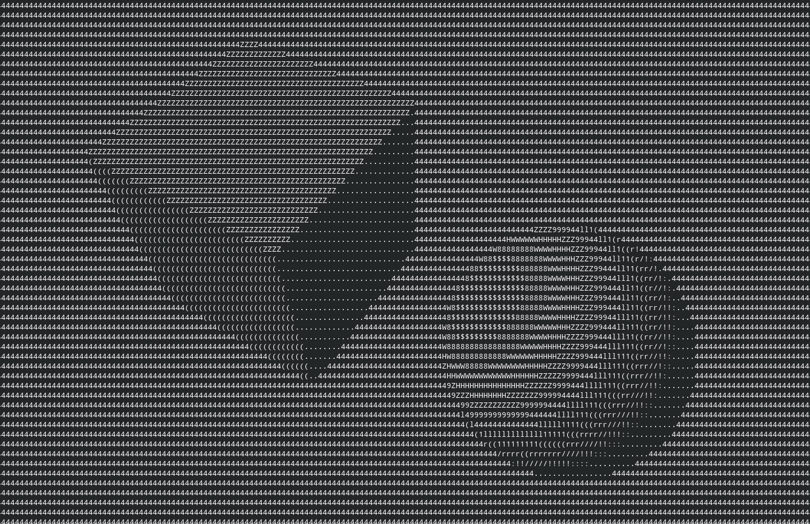

# Результат



# Компиляция

```
g++ -Wall -lm -lncurses ray_tracing.cpp vectors.h objects.h
./a.out
```

# Под капотом
---

Разберём __проблему о пересечении луча и плоскости.__

Плоскость можно однозначно определить вектором нормали - n (определяет ориентацию в пространстве) и точкой d (смещение относительно начала координат, например d = 3 сместит плоскость на -3 по всем осям).

Так же задан луч с начальной точкой C выпущенный в направлении направляющего вектора ray.

Точка Р - точка пересечения плоскости с лучом, можно задать как:

```
P = C + t * ray
```

Плоскость можно задать как:

```
P * n + d = 0
```

Подставляем одно во второе и получаем:

```
(C + t * ray) * n + d = 0
```

Откуда:

```
t = -(d + C * n) / (ray * n)
```

Соответственно, это наше расстояние от начальной точки С до точки пересечения Р, t > 0 - пересечение есть.
